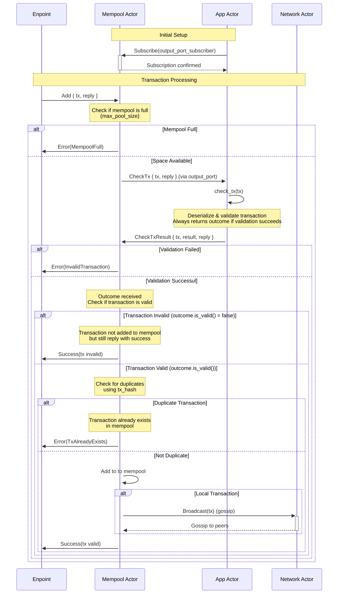

# Malachite consensus engine mempool

A mempool implementation for Malachite BFT Consensus Engine

**Note: This project is currently under active development and is not yet production-ready.**

## Transaction flow

The following diagram shows how a transaction flows through the mempool system:

**Key behaviors:**
- **Network transactions**: Transactions received from peer nodes follow the same validation flow but are not re-gossiped to prevent network loops and duplicate transaction.
- **Individual gossip**: Each transaction is currently gossiped individually without batching optimization
- **Error types**: The mempool returns specific `MempoolError` variants:
  - `MempoolFull`: When the mempool has reached its maximum capacity
  - `InvalidTransaction`: When transaction validation fails 
  - `TxAlreadyExists`: When attempting to add a duplicate transaction

## License

Copyright © 2025 Informal Systems AG. All rights reserved.

This repository and its contents, including but not limited to source code, documentation, specifications, and associated materials (collectively, the "Software"), are proprietary to Informal Systems AG (the "Company").

The Software is provided for reference purposes only. No license, express or implied, is granted. You may not copy, modify, distribute, sublicense, or use the Software, in whole or in part, for any purpose—commercial or non-commercial—without the prior written consent of the Company.

Unauthorized use of this Software is strictly prohibited.
